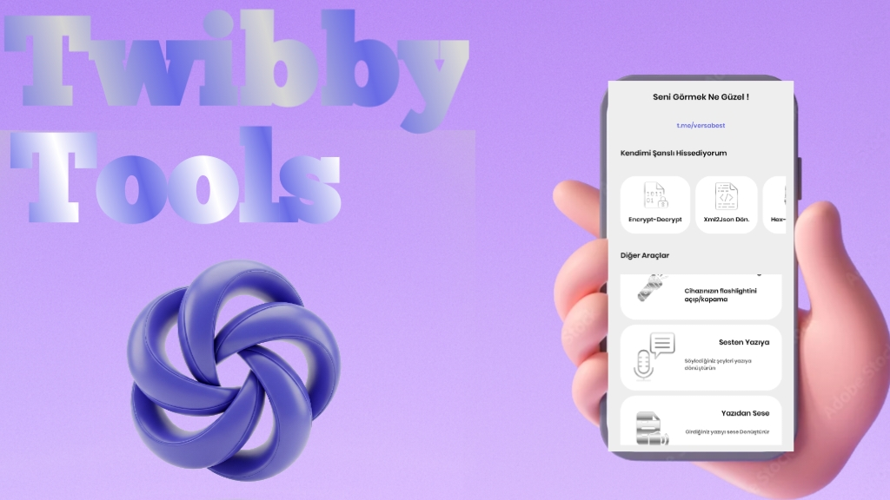

  

<h1 align="center">🚀 Twibby</h1>

  <strong>Android dünyasının her ihtiyaca cevap veren akıllı araç kutusu!</strong> 
  Geliştiriciden son kullanıcıya kadar herkesin cebinde bulunması gereken bir uygulama.

---

## 🌟 Twibby Nedir?

Twibby, **tek bir çatı altında onlarca farklı işlevi** bir araya getiren,  
hem günlük kullanıcılar hem de profesyonel geliştiriciler için tasarlanmış **çok amaçlı Android yardımcı uygulamasıdır**.  
Kimi zaman bir geliştirici aracına, kimi zaman bir PDF dönüştürücüsüne, kimi zaman ise sadece bir el fenerine ihtiyacınız olur…  
İşte Twibby, **hepsini bir arada** sunar.  
Modern tasarımı, yüksek performansı ve sürekli güncellenen özellikleriyle, cebinizde taşıdığınız **mobil bir İsviçre çakısı** gibidir.

---

## 🔥 Öne Çıkan Özellikler

Aşağıda Twibby’nin sunduğu araçlar, **kategorilere ayrılmış** ve detaylı şekilde açıklanmıştır.  
Her özellik, **hızlı çalışması**, **kolay kullanımı** ve **profesyonel sonuçlar vermesi** ile öne çıkar.

---

### 🔐 Güvenlik ve Şifreleme Araçları
- **Encrypt / Decrypt:** İster kişisel notlarınızı, ister önemli belgelerinizi şifreleyin; tek tıkla güvenli hale getirin.  
  Çözme özelliği sayesinde verilerinize sadece sizin erişebilmeniz garanti altına alınır.
- **Şifre Generator:** Güçlü, tahmin edilemez ve karmaşık şifreler oluşturur.  
  İster 8 hanelik ister 32 hanelik olsun, tamamen rastgele üretilir.
- **Yazıdan Binary:** Metinlerinizi ikili sisteme çevirerek veri işleme veya özel şifreleme yöntemleri için kullanın.
- **IP Sorgu:** IP adresinizin detaylarını öğrenin; ülke, servis sağlayıcı ve konum bilgilerini anında görüntüleyin.

---

### 🛠️ Geliştirici Dostu Araçlar
- **XML → JSON Dönüştürücü:** XML verilerinizi, API’ler ve modern projelerde daha çok tercih edilen JSON formatına çevirin.  
  Hızlı, hatasız ve çevrimdışı çalışır.
- **Hex / Dex Makinesi:** Sayısal dönüşümleri kolayca yapın; hexadecimal, decimal gibi formatlar arasında geçiş yapın.
- **Java Class Methodları:** Java geliştiricileri için hazır metod listesi. Kod yazarken zaman kazandırır.
- **145 Adet Java Kod Bloğu:** Her biri test edilmiş, kullanıma hazır Java kod parçaları.  
  Basit işlemlerden karmaşık yapılara kadar hepsi elinizin altında.
- **APK İmzalayıcı:** V1, V2 ve V3 imzalama desteği ile uygulamalarınızı güvenli şekilde imzalayın.  
  Google Play uyumluluğu garantilenmiştir.
- **Web Site Source Görüntüleme:** Bir web sitesinin HTML kaynak kodunu anında görün.
- **Web Site Directory Bulucu:** Web sitelerinin dizin yapılarını keşfedin.
- **SDK ve Android Sürümü Gösterme:** Cihazınızın teknik bilgilerini öğrenin; uygulama uyumluluğunu test edin.

---

### 📄 PDF ve Dönüştürme Araçları
- **Yazıdan PDF:** Notlarınızı veya belgelerinizi PDF formatına dönüştürün.
- **Resimden PDF:** Fotoğraflarınızı yüksek kalite PDF’e çevirin.
- **Web Sitesini PDF Yapma:** İstediğiniz web sayfasını PDF olarak kaydedin. Çevrimdışı arşiv oluşturmak için mükemmel.
- **PDF Okuma:** PDF belgelerini uygulama içinden hızlıca açın, sayfalar arasında gezinin.

---

### 📱 Cihaz Araçları
- **Uygulama Listesi:** Cihazınızdaki tüm uygulamaları, versiyon bilgileri ve ek detaylarıyla listeleyin.
- **Flashlight:** Tek tuşla güçlü el fenerinizi açın.
- **Sesten Yazıya:** Sesli konuşmanızı anında yazıya dökerek notlarınızı kaydedin.
- **Yazıdan Sese:** Metinleri doğal ses tonunda yüksek sesle okutun.

---

### 🤖 Entegrasyonlar
- **Telegram Bot Mesaj Gönderme:** Telegram bot hesabınız üzerinden mesaj göndermenizi sağlar.

---

## 🆕 Son Güncelleme Notları (v2.0.1)

> **Not:** Bu değişiklikler en güncel sürümde yer almaktadır.

- 📌 **Drawer Menu** kaldırıldı → Arayüz çok daha sade, hızlı ve kullanışlı hale getirildi.  
- 🎨 Yepyeni **Kayıt Olma** ve **Giriş Yapma** sayfaları tasarlandı; modern ve akıcı bir deneyim sunuyor.
- 🔏 **APK Signer** artık **V2** ve **V3** imzalama şemalarını destekliyor.
- 💻 **145 adet Java kod bloğu** eklendi.
- 🌐 **Web2PDF** aracı eklendi; web sitelerini anında PDF olarak kaydedin.
- 🎨 Tema rengi **#696BE6** olarak güncellendi.

---

## 💡 Açık Kaynak Gücü

Twibby artık **tamamen açık kaynak**!  
Bu, kodun tamamen şeffaf, incelenebilir ve geliştirilebilir olduğu anlamına geliyor.  
İsteyen herkes projeye göz atabilir, katkı sağlayabilir veya kendi ihtiyaçlarına göre uyarlayabilir.  

> Açık kaynak olması sayesinde, Twibby sadece bir uygulama değil, **geliştirici topluluğunun ortak bir eseri** haline geliyor.  
> Bugün kullandığınız bir özellik, yarın başka bir katkıcı tarafından geliştirilmiş veya daha da iyileştirilmiş olabilir.  

**Sen de katkı sağla:**  
- 🛠️ Yeni özellik ekleyebilirsin.  
- 🐞 Hataları düzeltebilirsin.  
- 📖 Belgeleri geliştirebilirsin.  

Katkıda bulunmak için bu repo’yu **fork**'la, değişikliklerini yap ve bir **pull request** gönder.  

---

## 📥 İndir & Kurulum
- **Google Play** ve **GitHub Releases** üzerinden yakında yayında olacak.  
- Yükledikten sonra tüm araçlara **çevrimdışı** erişebilirsiniz.

---

## 📌 Lisans
Bu proje **MIT Lisansı** ile lisanslanmıştır. Detaylı bilgi için [LICENSE](LICENSE) dosyasına göz atabilirsiniz.
